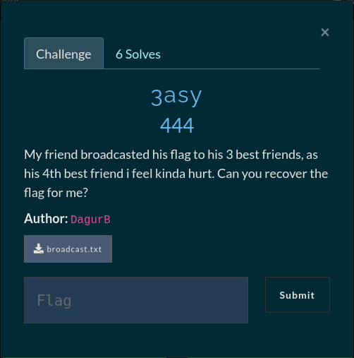

# 3asy


### Hastad’s Broadcast attack

When a message is encrypted multiple times with RSA and
a low exponent (e) is present there is a possiblity
that it might be vulnerable to a Hastad Broadcast attack

#### Solution

First i thought it was a low exponent attack
and that i had to just compute the plaintext
of all the three messages. That didn't work out
so i resorted to the internet, just searching for
`ctf small exponent crypto` gave a very nice blog
about various crypto attacks and the first attack
being *Hastad's Broadcast Attack* [Basic RSA](https://medium.com/@hva314/some-basic-rsa-challenges-in-ctf-part-2-applying-theoretical-attack-55a2cc7baa11) Reading through the blog post we can see that sagemath is being used to compute the messages.

**Installing and using sagemath**

Sagemath can be installed easily with apt `sudo apt install sagemath`
computing the plaintext with sage can be done by following the same
steps as in the blog post, by using the Chinese Remainder Theorem
we can compute the plaintext (M)

Sage commands

```
┌────────────────────────────────────────────────────────────────────┐
│ SageMath version 9.4, Release Date: 2021-08-22                     │
│ Using Python 3.9.10. Type "help()" for help.                       │
└────────────────────────────────────────────────────────────────────┘
sage: n1 = 207311852606297573162222863770954648974874989861070583158900173573322734131438249335501780353266720532663556569431572506518555530316044402537608967873696295943587568282172615910797713996263039009129202
....: 87118565628860534033766121255708998826104238735176890737894498804400810342592194643099258462538685033566765264470891851991758232531145508516702247828252129576289374712091471960803668466743551327364887711686
....: 17641082494449076954643359141621518670031660681960457176174332456907195775075243209457880488660592649111106114346735893830835660655127806538782027465227849628086270147041422360303543129961463546292160950450
....: 1503
sage: n2 = 181815487373932137820217150345445627700524250813295212344548558242854680979545549652018551663291374226345927723419448637415678567533327431921090899687690437760316726899994353823957522085053407541469342
....: 53663622216113170682220294255524425700496068171125264497451741741386243559414252347630930782888457529853933632277114666558340394507888777829167071276961869771779934488647632855485265751428401797312540323352
....: 43947378030591812230297008785882057810613945407688569523082930632486800358565535798568647749310616243987821149651814067657024248616095217495517509615870112088589172880957317760288007770433695912426544910216
....: 7253
sage: n3 = 201986291193417881178075971836018796600545649918786553681412385183061467521753806238327979526135627607393834191907200529127613122631349226503353423142022480963819977426903669582745044982348002387291102
....: 10270616513835796549943182591463815536961399205985700065247327497814997952549116705497464537045745299378682936747598274768646384968527544814329912579137495110527413003221242190244154802394081633225719639037
....: 78161320961065858658063897773686028703990477624760732213010996109068597165379067967646017916274645710476975769279203539358431320992390451159215385974420656645363793665121382286652720755279691023447237936016
....: 5529
sage: e = 3
sage: ct1 = 26452060171771953847867415124057570983052078968239365586377185855675456537343732432219642795701310297198405517792365013995639228822234185996307221912130536648411529138208807178986317829539148331122316
....: 76484181177375735240684366682486331347514575786174936538406499024313368822745537450205627526907766582171433281146659976406565914980700319938263208069599377356963385207188874901625041319951883274595948846908
....: 21083437736138088863371091049237443310097293073912961617820944230388297609079847497858954019464672982386604798801338356507415857852228906832173541710698255282598901345971920106343027563624866856602717006519
....: 0231
sage: ct2 = 11680387134603873895430447853534100784228925767997110014315072884109933549372419128460035500629773930979268394109012992467551858271625905236515130087041848164028799534894518160495859579008605857812676
....: 89340909462430137493982207122292435056416928494072938509522423634890347471784707779490146959605590366127419623256470370435189786444875394233955621044879257884772545239303071156915383826932098209413995357471
....: 51367711841235372702986455178062005699537035834505413256907086246321044475540365419953546235243144263817682625924131006865061540552476384869864636162630862693910767715202445686000372122598729095117945779975
....: 63014
sage: ct3 = 17951560269082627190659294604427555293312950038084057756769861046260729796876158590471849113475679746933988935336135952351093456855970993745121373191351944913786708518712831574851408302752879452571483
....: 87974175852885470641720048494844640862494912806730693714925078314662750208447826520823772233149395628128584183034435520693492782368836051122227412088212148035791723003035917654762131991469708639046125330116
....: 55744855612748290247902819850806876759111492261398722803436550544373623906205009453868918228691196625608216607836457671159954303740026840979575571895069371763966602867687853110622783026895890784702589234150
....: 2059
sage: M = crt([ct1,ct2,ct3],[n1,n2,n3])
sage: m = M ** (1/3)
sage: m
482740108019164396643218348909963864134458096507824368405981207841383714139206665760170844595330214386411511270283793741906619502566758447542176198570868571389931143955755150328693933599147058344028428308366470263747448612975233453364255859069
sage: 
```

This was my first time using sagemath so to convert the plaintext to readable text i used python
```python
python3 -c "from Crypto.Util.number import long_to_bytes;m=482740108019164396643218348909963864134458096507824368405981207841383714139206665760170844595330214386411511270283793741906619502566758447542176198570868571389931143955755150328693933599147058344028428308366470263747448612975233453364255859069;print(long_to_bytes(m).decode())"
```

```
The message:

Hey, Heres my precious flag. Take good care of it, it is very valuable. gg{H4sTad_s3Nds_h1S_r3g4RDs!}
```

**FLAG: gg{H4sTad_s3Nds_h1S_r3g4RDs!}**