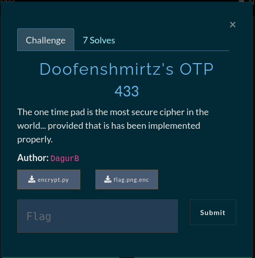
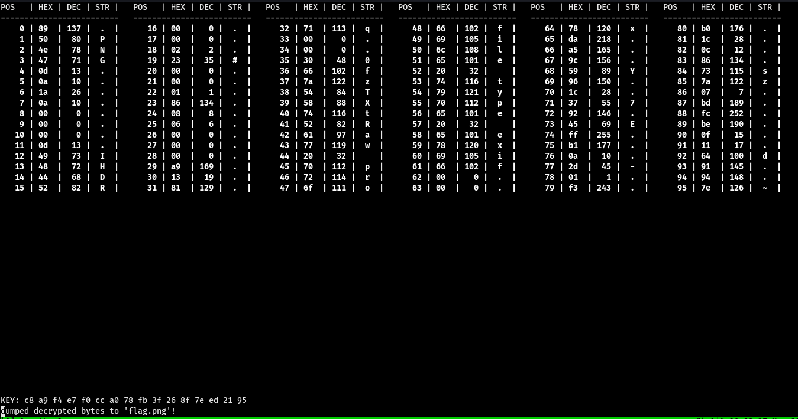

# Doofenshmirtz's OTP


# OTP - Known Plaintext Attack

We are given two files, an image called `flag.png.enc` and a python script called `encrypt.py` looking at script file we see that 16 random bytes from `urandom()` get XORed with the image. Because we know the file format of the image (`PNG`) we can reconstruct the original image by supplying the first 16 bytes of the `PNG` file format.

## OTP
*In cryptography, the one-time pad (OTP) is an encryption technique that cannot be cracked, but requires the use of a single-use pre-shared key that is not smaller than the message being sent.*
*The resulting ciphertext will be impossible to decrypt or break if the following four conditions are met:**

- *The key must be at least as long as the plaintext.*
- *The key must be ***random***

*source - [wikipedia](https://en.wikipedia.org/wiki/One-time_pad)*


## Challenge

Let's take a look at our challenge files. We are given a python script file that was used to encrypt the image with and then we have the encrypted image.

```python
#!/usr/bin/env python2

from pwn import xor
from os import urandom

with open('flag.png') as f:
	image = f.read()

OTP = urandom(16)
image = xor(OTP, image)

with open('flag.png.enc', 'w') as f:
	f.write(image)
```

Here we can see that the original image is XORed with a OTP (One-Time-Pad) which is 16 random bytes from `urandom()`. The goal here is to retrieve the original image from the encrypted one, so looking closer at what we have and what we know about the OTP we  might be able to get the original image. A OTP should be **random** and at least as long as the plaintext itself to be secure, in our case the OTP is shorter than the plaintext and most importantly the OTP key is not **random**. We know that the encrypted image is a `PNG` image file meaning that we know some bytes that relate to the image file format


## Cracking the OTP key

Now that we know what the vulnerability is we can get to work with extracting the OTP key and reconstruct the original image. We can use an open-source tool on github to help us do the job [otp_pwn](https://github.com/derbenoo/otp_pwn)
With this tool we can supply our encrypted image and the key lenght which we know is 16-bytes from the python script `python otp_pwn.py [encrypted_file] [key_lenght]` Now that we are viewing the first 16 bytes of the image we can go look up the `PNG` file structure and get our 16-bytes [PNG File format](https://en.wikipedia.org/wiki/Portable_Network_Graphics) we can supply each offset and plaintext by using the command `:phex [offset] [plaintext]` where the plaintext is our byte in hex. After having inserted correct bytes at the correct offsets we should have the decryption key displayed on the bottom of the screen and we can dump the file decrypted with the derived key to a file.



Now we should have a valid `PNG` image file which we can view and there is our flag.


### Resources

https://derbenoo.github.io/ctf/2017/08/12/sha2017_ctf_stack_overflow/
https://en.wikipedia.org/wiki/Portable_Network_Graphics
https://github.com/derbenoo/otp_pwn

