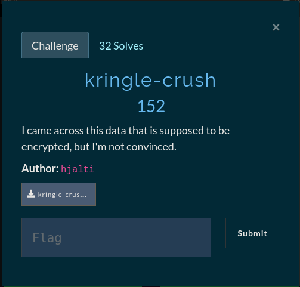

# kringle-crush



solve.sh
```bash
#!/bin/bash
b64reved=`cat kringle-crush.txt`
realb64=`echo "$b64reved" | rev`
echo "$realb64" | base64 -d

# FLAG: gg{Timing Toast: There's an art of knowing when. Never try to guess. Toast until it smokes and then twenty seconds less.}
```
