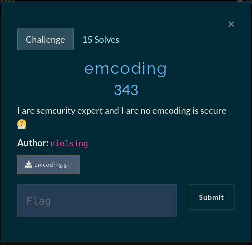
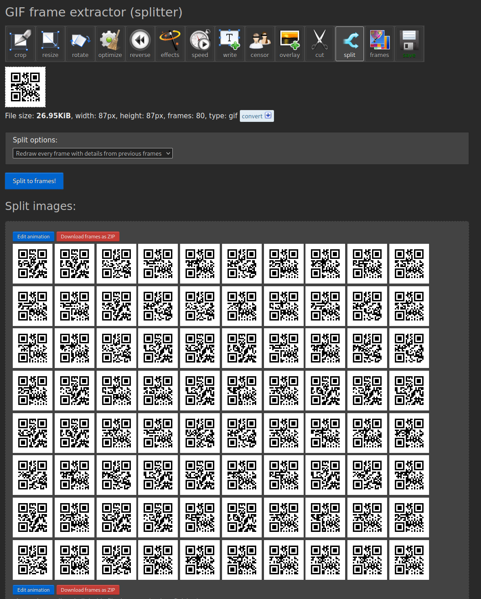

# emcoding




### QR Code Magic

We are given a GIF which seems to iterate over many frames to assemble a valid QR Code.
The approach here is to extract the frames out of the GIF and from there we can scan each image individually and combine the output to create a valid base32 string which can then be decoded into a flag.

To split the GIF and extract the frames i used [ezgif](ezgif.com)



To scan each frame and decode the flag i made this simple script

```python
#!/usr/bin/python3

from subprocess import run, PIPE
from base64 import b32decode


# Some vars

QR_Letters = []
zip_name = "ezgif-2-74aff622fa-gif-im.zip"


# unzip GIF frames
run(["unzip", "-q", zip_name])


# Use zbarimg on each image

for i in range(80):
    num = str(i).zfill(2)
    filename = f"frame_{num}_delay-0.04s.gif"
    letter = run(["zbarimg", filename], capture_output=True, text=True, stdin=PIPE)
    QR_Letters.append(letter.stdout)


# Remove empty strings in list, decode base32 and print flag

QR_Letters = [x.strip()[8::] for x in QR_Letters if x]
base32_string = ''.join(QR_Letters)
print("[+] FLAG:", b32decode(base32_string).decode('latin-1'))


# Cleanup

for i in range(80):
    num = str(i).zfill(2)
    filename = f"frame_{num}_delay-0.04s.gif"
    run(["rm", filename])


# FLAG: gg{semcurity_by_omscurity_err_I_mean_emcoding}
```
