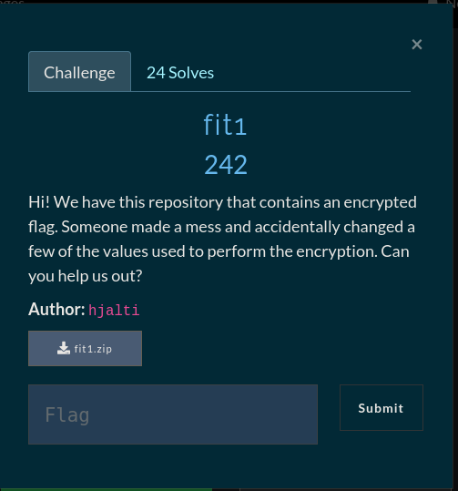

# fit1


## Git Diff

Moving into the `.git` directory and using `git diff`
we can see all the changes that were done, now we just
revert the changes and run the `main.py` python script and
get our flag.

FLAG
```
gg{gitN3vErf0rge7s}
```
