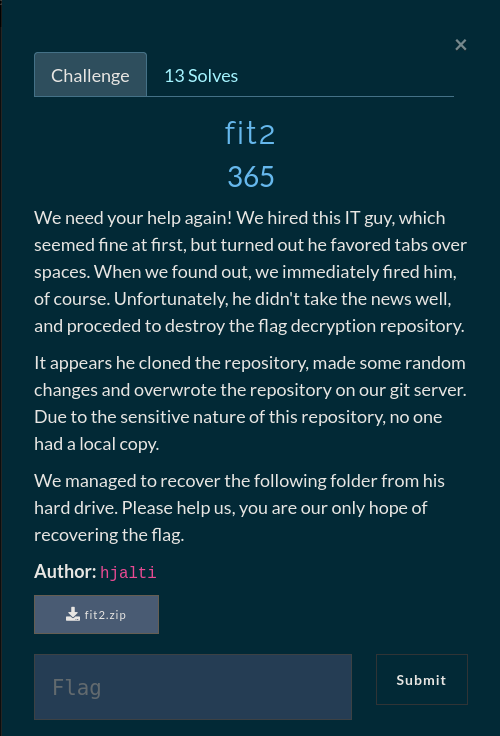

# fit2

## Git diff - Revert a Patch

For this challenge we are given the exact same files and direcotries as for *fit1* but this time
there is only one initial commit which messes up the decryption algorithm. Looking inside the `repo/` directory and listing all files including hidden files and folders with `ls -la`
We can see that we have a `.diff` file. This so called diff file is a patch which is generated by running `git diff` and saving the output to a file. With this information we can just [google](https://stackoverflow.com/questions/34400885/how-can-i-remove-an-applied-git-patch) around for a way to revert from a patch and sure enough we quickly get the command to do just that. cd to the `repo/` directory and run `git apply -R <patch>`
Run the `main.py` script and get the flag

**FLAG: gg{gitIsFitwhenShitHitsth3f4n}**