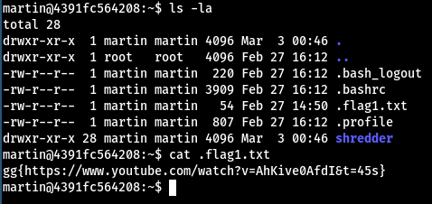

# esc-server

## esc-server 0


## esc-server 1


Check hidden directories `ls -la`



## esc-server 2


Checking jon's **.zsh_history**

```bash
: 1603010967:0;cd /                                                                                                                                                                                                                                                                                                                                                                                                                      
: 1603010969:0;cd etc                                                                                                                                                                                                                                                                                                                                                                                                                    
: 1603010973:0;cd wat                                                                                                                                                                                                                                                                                                                                                                                                                    
: 1603010981:0;mv ~/flag.txt inconspicuous                                                                                                                                                                                                                                                                                                                                                                                               
: 1603010995:0;sed -i -e 's/gg{/hidden[/' -e 's/}/]/' -e 's/4/A/'

```
Now we just find the flag and reverse the sed command


```
hidden[ = gg{
] = }
A = 4
```

**Flag: gg{https://www.youtube.com/watch?v=gJRXodZoP40&t=18s}**


## esc-server 3


```bash
find /home/martin/shredder/ -type f -newermt "2022-02-22" ! -newermt "2022-02-23" 2>/dev/null | awk -vFS=/ -vOFS=/ '{ print $NF,$0 }' | sort -n -t / | cut -f2- -d /
```

partially correct. Sorts the filenames that have double digits correct for example: p44,p12,p26 But fails to correctly sort single digit files for example: p1,p2,p3

Manually separating the one digit files and the two digit files we can create two text files on the server `lower.txt` and `higher.txt`
the server does not have a text editor so just using `echo` and writing the lines to the files will work just file. When that has been done we can read both the files with the commands 
```bash 
cat lower.txt | while read files; do cat $files; done
```

For the lower numbered files the output would be `gg{https:/` and the higher numbered files would output `/www.youtube.com/watch?v=0Jl-Hr137uM#unb0rken}` adding the two strings together could create a valid flag 

**gg{https://www.youtube.com/watch?v=0Jl-Hr137uM#unb0rken}**

## esc-server 4


Looking at our sudo permissions we see that we are allowed to use sudo on the cat binary. This is starting to look like a privielege escalation challenge so after looking over at [GTFObins](https://gtfobins.github.io/) and finding nothing of value there we should look at the version of sudo the server is running, sure enough it's an old version of sudo. Simply searching the web for `sudo 1.8.28patched exploit` we get a post detailing a security bypass in the sudo version we are running [sudo security bypass](https://packetstormsecurity.com/files/154857/sudo-1.8.28-Security-Bypass.html)


## esc-server 5


We can use the same exploit we used for *esc-server 4* but instead point to the root flag.


