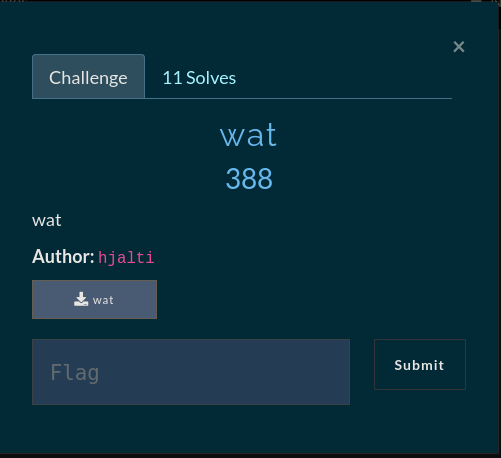
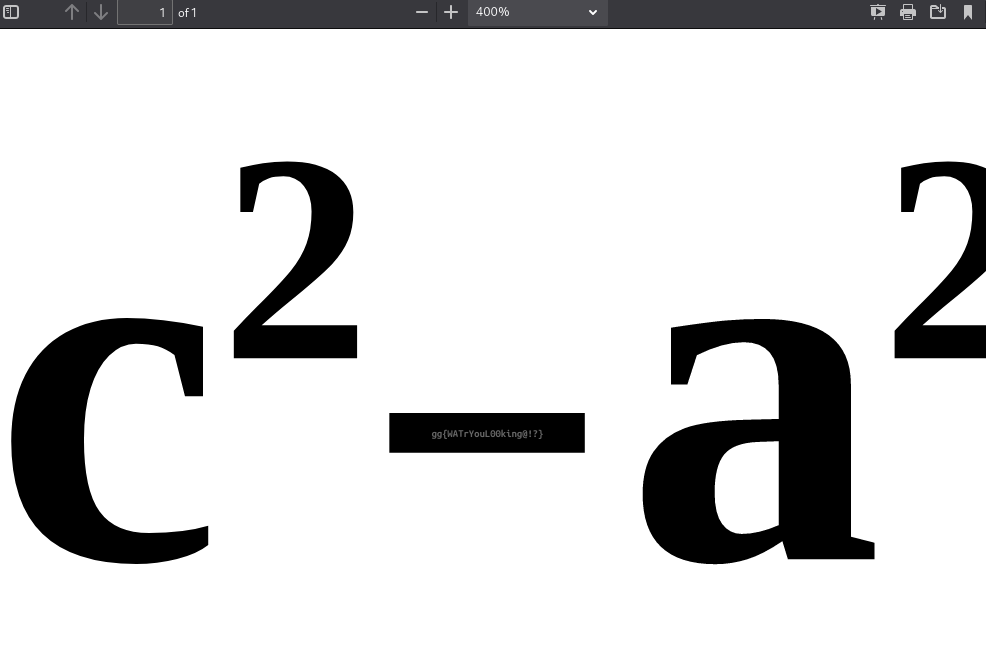

# Wat

## Reversed PDF



A PDF document that has been reversed byte-for-byte
and random bytes inserted between every byte.

Using a simple python script to reverse the bytes
creates a valid PDF document which when opened
reveals a seemingly standard math equation (the Pythagorean theorem)
But looking closer at the file the flag is hidden inside the negative sign (-)

Script to reverse the bytes and create a valid PDF
```python
#!/usr/bin/python3

with open('wat', 'rb') as f:
    data = f.read()

with open('rev.pdf', 'wb') as f:
    f.write(data[::-1])

# FLAG: gg{WATrYouL00king@!?}
```



**FLAG: gg{WATrYouL00king@!?}**