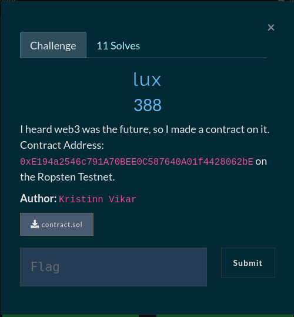
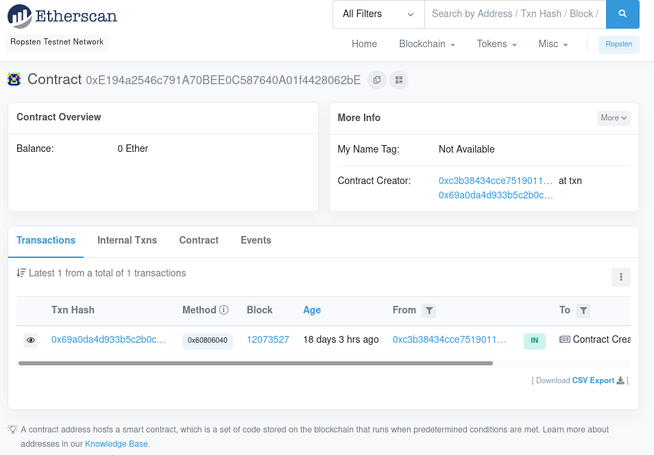
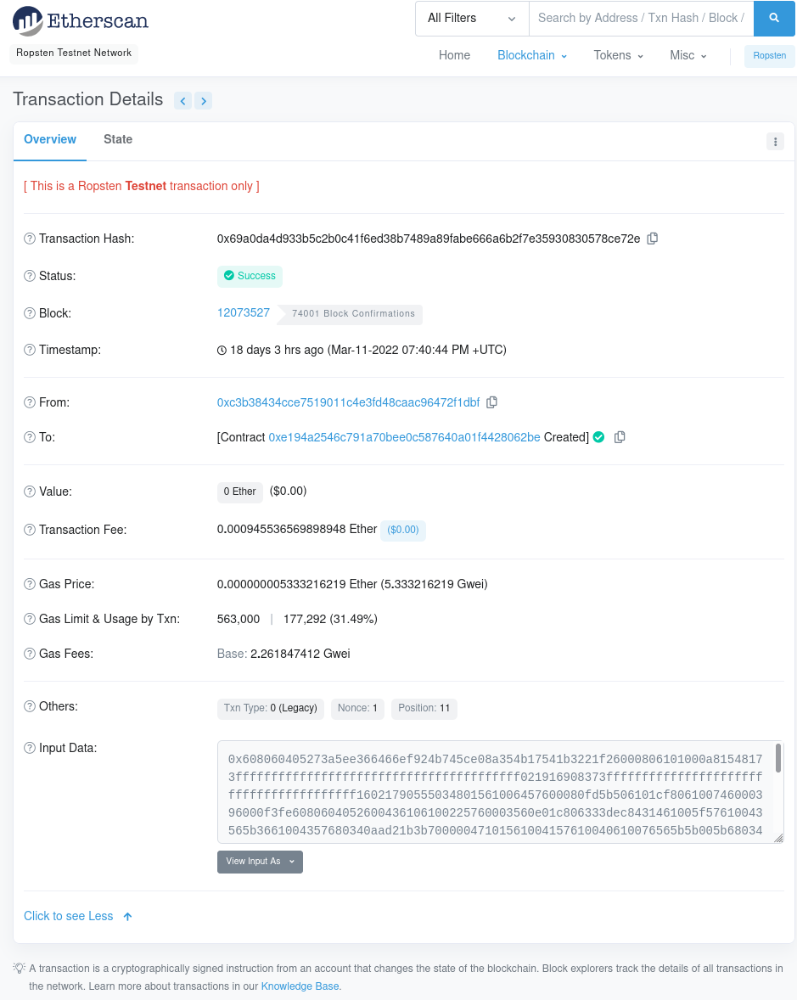
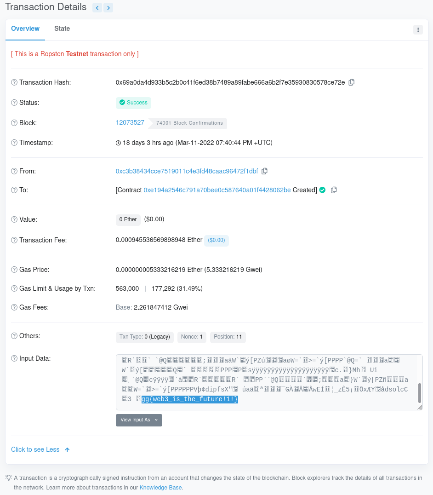

# Introduction to Smart Contracts



We are given an address a website and a `.sol` file, with this information we can start to
work on the challenge. First we can check out the contract/transaction on the given website `the Ropsten Testnet` --> `https://ropsten.etherscan.io/`



Cool! Now we have the contract, let's look at the solidity file (`.sol`)

```
// SPDX-License-Identifier: MIT
pragma solidity ^0.8.0;

contract Lux {
    string flag;
    constructor(string memory flagIN){
        flag = flagIN;
    }
}     
```

*Solidity is an object-oriented, high-level language for implementing smart contracts. Solidity is a curly-bracket language. It is influenced by C++, Python and JavaScript, and is designed to target the Ethereum Virtual Machine (EVM).*

Looking at the documentation for the language we learn that this code runs whats inside the constructor which in this case
just puts the flag into memory. With that in mind we can go and look a little deeper into the contract on the website




Looking at the last field we see Input data by default it's set to hex
but we know from the code that it is a string so we can change the view
to `UTF-8`. Looking at the last line of the Input data in `UTF-8` reveals the flag



**FLAG: gg{web3_is_the_future!1!}**