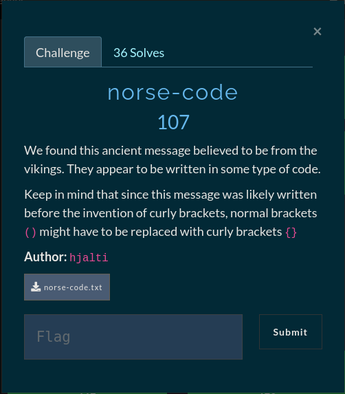

#  norse-code

## Nordic runes (Younger futhark) to morse-code



Looking at the challenge file in a hexdump

```
00000000  e1 9b 85 e1 9b 85 e1 9a  bd 20 e1 9b 85 e1 9b 85  |......... ......|
00000010  e1 9a bd 20 e1 9b 85 e1  9a bd e1 9b 85 e1 9b 85  |... ............|
00000020  e1 9a bd e1 9b 85 20 e1  9b 85 e1 9a bd e1 9b 85  |...... .........|
00000030  20 e1 9a bd 20 e1 9a bd  20 e1 9a bd e1 9b 85 e1  | ... ... .......|
00000040  9b 85 e1 9a bd 20 e1 9a  bd e1 9a bd e1 9b 85 e1  |..... ..........|
00000050  9b 85 e1 9a bd e1 9b 85  20 e1 9b 85 e1 9a bd e1  |........ .......|
00000060  9b 85 e1 9b 85 20 e1 9b  85 e1 9b 85 e1 9b 85 20  |..... ......... |
00000070  e1 9a bd e1 9a bd e1 9b  85 20 e1 9a bd e1 9b 85  |......... ......|
00000080  e1 9a bd 20 e1 9a bd e1  9a bd e1 9b 85 e1 9b 85  |... ............|
00000090  e1 9a bd e1 9b 85 20 e1  9a bd e1 9a bd e1 9b 85  |...... .........|
000000a0  e1 9a bd 20 e1 9a bd e1  9b 85 e1 9a bd 20 e1 9a  |... ......... ..|
000000b0  bd e1 9a bd 20 e1 9a bd  20 e1 9b 85 e1 9a bd 20  |.... ... ...... |
000000c0  e1 9b 85 e1 9a bd e1 9a  bd 20 e1 9a bd e1 9a bd  |......... ......|
000000d0  e1 9a bd 20 e1 9a bd e1  9a bd e1 9b 85 e1 9b 85  |... ............|
000000e0  e1 9a bd e1 9b 85 20 e1  9b 85 e1 9a bd e1 9b 85  |...... .........|
000000f0  e1 9a bd 20 e1 9a bd e1  9b 85 e1 9a bd e1 9a bd  |... ............|
00000100  20 e1 9b 85 e1 9b 85 e1  9b 85 20 e1 9a bd e1 9a  | ......... .....|
00000110  bd e1 9a bd 20 e1 9a bd  20 e1 9a bd e1 9a bd e1  |.... ... .......|
00000120  9b 85 e1 9b 85 e1 9a bd  e1 9b 85 20 e1 9a bd e1  |........... ....|
00000130  9b 85 20 e1 9b 85 e1 9a  bd 20 e1 9b 85 e1 9a bd  |.. ...... ......|
00000140  e1 9a bd 20 e1 9a bd e1  9a bd e1 9b 85 e1 9b 85  |... ............|
00000150  e1 9a bd e1 9b 85 20 e1  9b 85 e1 9a bd e1 9b 85  |...... .........|
00000160  e1 9b 85 20 e1 9b 85 e1  9b 85 e1 9b 85 20 e1 9a  |... ......... ..|
00000170  bd e1 9a bd e1 9b 85 20  e1 9a bd e1 9b 85 e1 9a  |....... ........|
00000180  bd 20 e1 9a bd e1 9a bd  e1 9b 85 e1 9b 85 e1 9a  |. ..............|
00000190  bd e1 9b 85 20 e1 9a bd  20 e1 9b 85 e1 9a bd 20  |.... ... ...... |
000001a0  e1 9a bd 20 e1 9b 85 e1  9b 85 20 e1 9a bd e1 9a  |... ...... .....|
000001b0  bd 20 e1 9a bd 20 e1 9a  bd e1 9a bd e1 9a bd 20  |. ... ......... |
000001c0  e1 9a bd e1 9a bd e1 9b  85 e1 9b 85 e1 9a bd e1  |................|
000001d0  9b 85 20 e1 9a bd e1 9b  85 20 e1 9a bd e1 9a bd  |.. ...... ......|
000001e0  e1 9b 85 e1 9b 85 e1 9a  bd e1 9b 85 20 e1 9a bd  |............ ...|
000001f0  e1 9b 85 e1 9a bd e1 9a  bd 20 e1 9a bd e1 9a bd  |......... ......|
00000200  20 e1 9b 85 20 e1 9b 85  20 e1 9a bd e1 9b 85 e1  | ... ... .......|
00000210  9a bd e1 9a bd 20 e1 9a  bd 20 e1 9a bd e1 9a bd  |..... ... ......|
00000220  e1 9b 85 e1 9b 85 e1 9a  bd e1 9b 85 20 e1 9b 85  |............ ...|
00000230  e1 9a bd e1 9a bd e1 9a  bd 20 e1 9a bd e1 9a bd  |......... ......|
00000240  20 e1 9b 85 20 e1 9a bd  e1 9a bd e1 9b 85 e1 9b  | ... ...........|
00000250  85 e1 9a bd e1 9b 85 20  e1 9a bd e1 9a bd e1 9b  |....... ........|
00000260  85 e1 9a bd 20 e1 9a bd  e1 9a bd e1 9b 85 20 e1  |.... ......... .|
00000270  9a bd e1 9b 85 e1 9a bd  20 e1 9b 85 20 e1 9a bd  |........ ... ...|
00000280  e1 9a bd e1 9a bd e1 9a  bd 20 e1 9a bd 20 e1 9a  |......... ... ..|
00000290  bd e1 9b 85 e1 9a bd 20  e1 9a bd e1 9a bd e1 9b  |....... ........|
000002a0  85 e1 9b 85 e1 9a bd e1  9b 85 20 e1 9a bd e1 9b  |.......... .....|
000002b0  85 20 e1 9a bd e1 9b 85  e1 9b 85 20 e1 9a bd e1  |. ......... ....|
000002c0  9b 85 20 e1 9b 85 e1 9a  bd e1 9b 85 e1 9b 85 20  |.. ............ |
000002d0  e1 9b 85 e1 9a bd e1 9b  85 e1 9b 85 e1 9a bd e1  |................|
000002e0  9b 85 0a                                          |...|
000002e3
```
It looks very similar to morse code but the hex values do not match a valid morse code pattern. We know the flag format is `gg{` but gg in morse code would have the hex values of `2d 2d 2e 20 2d 2d 2e 0a` which does not match our hex values. Searching on google for the hex values gives us very liitle information but when we open up the file in a text editor (i used gedit) we get another piece to the puzzle. A unicode character with `U+16E5` inside the square box, looking for that number on google gives us that it's a long-branch runic letter (i used [website](https://www.fileformat.info/info/unicode/char/16c5/index.htm)). Knowing that we are dealing with some sort of runes we can lookup some runic alphabets or runic cipher decoders, i decided to look for runic alphabet decoders and ended up finding two runic alphabets called `Young Futhark` and `Elder Futhark`. Trying to decode the square boxes (runic letters) with the Elder Futhark alphabet gave no meaningful output so i tried the Younger Futhark alphabet ([Decoder](https://www.dcode.fr/younger-futhark)) and got some interesting output.

```
ææh ææh æhææhæ æhæ h h hææh hhææhæ æhææ æææ hhæ hæh hhææhæ hhæh hæh hh h æh æhh hhh hhææhæ æhæh hæhh æææ hhh h hhææhæ hæ æh æhh hhææhæ æhææ æææ hhæ hæh hhææhæ h æh h ææ hh h hhh hhææhæ hæ hhææhæ hæhh hh æ æ hæhh h hhææhæ æhhh hh æ hhææhæ hhæh hhæ hæh æ hhhh h hæh hhææhæ hæ hææ hæ æhææ æhææhæ
```
I had no clue what this could be so i just tried to use a ciphertext identifier from [decode.fr](https://www.dcode.fr/cipher-identifier)and morse code had a very high rating so i tried to decode the text as morse code and finally got the flag

```
GG)KEEP_YOUR_FRIENDS_CLOSE_AND_YOUR_ENEMIES_A_LITTLE_BIT_FURTHER_AWAY)
```
Following the challenge description we replace the parentheses with curly brackets
so we end up with a valid flag

```
FLAG: GG{KEEP_YOUR_FRIENDS_CLOSE_AND_YOUR_ENEMIES_A_LITTLE_BIT_FURTHER_AWAY}
```
