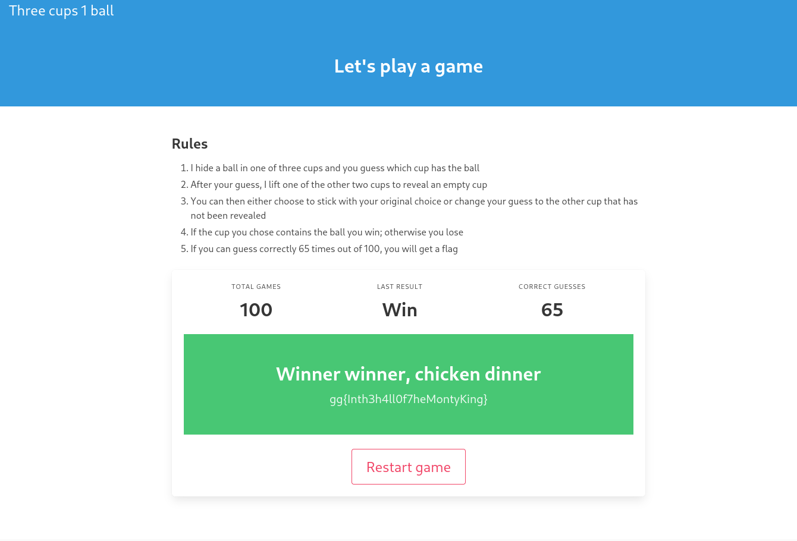

# Shell

### The game

Reading the rules carefully we can see that the game reassembles a very famous probability problem known as the **Monty Hall problem**. When we understand the brain teaser (the problem) we get to see that the chances of us guessing a correct cup is not `50%`. 

### The problem
At the beginning of the game we have exactly `1/3` chance of guessing the correct cup, then when the game master reveals that one of the cup does not have the ball in it we are left with two cups. Switching will increase our odds of guessing correctly to `2/3` but staying on our original cup still leaves us with `1/3` chance of guessing correcly. Knowing this we can play the game, choose a cup and switch everytime and after a few runs we should get our flag.

`FLAG: gg{Inth3h4ll0f7heMontyKing}`
