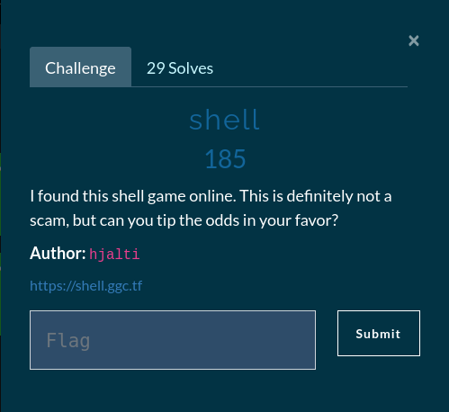
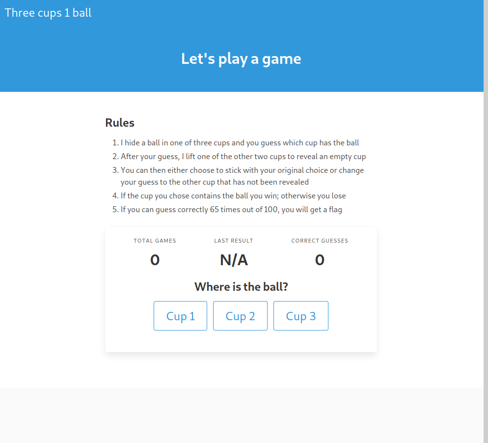

# Shell

## Flawed probability

If we read the game rules carefully we can see that the logic of the game is a bit flawed. After the player chooses a cup the game master reveals one empty cup making our chance of guessing the correct cup *50%* and the player only needs to win *65* games out of a *100*.
We can easily run a coin flip simulation and see how many times a player could win the game.
