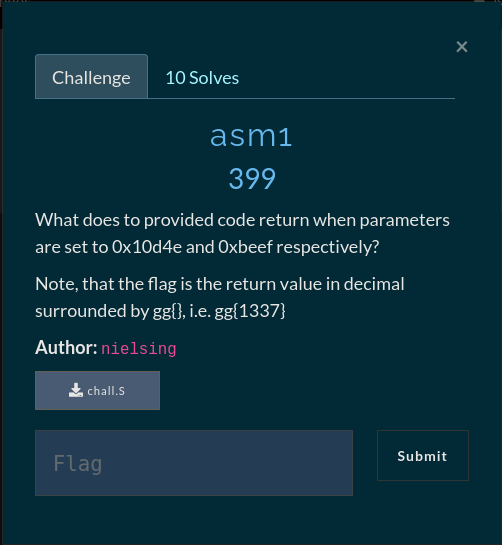

# Simple ASM



This challenge is all about just knowing assembly. We can read through the assembly
and figure out rather quickly that this is just a simple addition function.
A function that takes two numbers (edi,esi) and adds them together or rather
adds the first number on top of the other in a loop

We can also just be lazy and make the assembly code compile then view it in a decompiler

```asm
chall:
        push    rbp
        mov     rbp, rsp
        mov     DWORD PTR -20[rbp], edi
        mov     DWORD PTR -24[rbp], esi
        mov     DWORD PTR -4[rbp], 0
        jmp     .L2
.L3:
        mov     eax, DWORD PTR -24[rbp]
        add     DWORD PTR -20[rbp], eax
        add     DWORD PTR -4[rbp], 1
.L2:
        cmp     DWORD PTR -4[rbp], 4
        jle     .L3
        mov     eax, DWORD PTR -20[rbp]
        pop     rbp
        ret

```
*Challenge ASM*

```asm
global _start

section .text
_start:
        push    rbp
        mov     rbp, rsp
        mov     DWORD [rbp-20], edi
        mov     DWORD [rbp-24], esi
        mov     DWORD [rbp-4], 0
        jmp     .L2
.L3:
        mov     eax, DWORD [rbp-24]
        add     DWORD [rbp-20], eax
        add     DWORD [rbp-4], 1
.L2:
        cmp     DWORD [rbp-4], 4
        jle     .L3
        mov     eax, DWORD [rbp-20]
        pop     rbp
        ret

```
*Challenge ASM Cleaned*

Now compile and dump it into Ghidra, binja, IDA etc.

```
1. nasm -f elf64 <asm-file>
2. ld <asm-file.o> -o <new-binary>
```

Pesuedo-C - Ghidra

```C
int entry(int num1,int num2)

{
  int x;
  int i;
  
  x = num1;
  for (i = 0; i < 5; i = i + 1) {
    x = x + num2;
  }
  return x;
}
```

Solve script
```C
#include <stdio.h>

int add(int num1, int num2) {
        int sum;
        int i;
        sum = num1;
        for (i = 0; i < 5; i++) {
                sum = sum + num2;
        }
        return sum;
}

int main() {
        printf("[+] FLAG: gg{%d}", add(0x10d4e, 0xbeef));
        return 0;
}

```