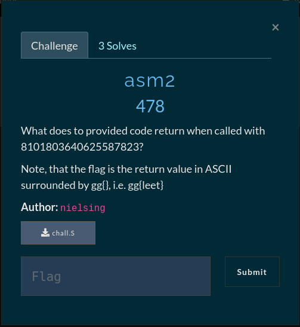

# ASM2 - Shifts



Here we are given an assembly file in which we deal with some shifts, adds and &'s. For this challenge we can follow the same steps as for asm1. Read the assembly and try to create a similar C program or we can let tools do the work for us, here i took the latter approach

First we modify the assembly a bit to be able to compile it

*Original challenge file*

```asm
chall:
        push    rbp
        mov     rbp, rsp
        sub     rsp, 32
        mov     QWORD PTR -24[rbp], rdi
        mov     edi, 9
        call    malloc@PLT
        mov     QWORD PTR -8[rbp], rax
        mov     DWORD PTR -12[rbp], 0
        jmp     .L2
.L3:
        mov     eax, DWORD PTR -12[rbp]
        sal     eax, 3
        mov     rdx, QWORD PTR -24[rbp]
        mov     ecx, eax
        shr     rdx, cl
        mov     rcx, rdx
        mov     eax, 7
        sub     eax, DWORD PTR -12[rbp]
        movsx   rdx, eax
        mov     rax, QWORD PTR -8[rbp]
        add     rax, rdx
        mov     edx, ecx
        mov     BYTE PTR [rax], dl
        add     DWORD PTR -12[rbp], 1
.L2:
        cmp     DWORD PTR -12[rbp], 7
        jle     .L3
        mov     rax, QWORD PTR -8[rbp]
        add     rax, 8
        mov     BYTE PTR [rax], 0
        mov     rax, QWORD PTR -8[rbp]
        leave
        ret

```

*Modified challenge file*

```asm
extern malloc
global _start

section .text

_start:
        push    rbp
        mov     rbp, rsp
        sub     rsp, 32
        mov     QWORD [rbp-24], rdi
        mov     edi, 9
        call    malloc
        mov     QWORD [rbp-8], rax
        mov     DWORD [rbp-12], 0
        jmp     .L2
.L3:
        mov     eax, DWORD [rbp-12]
        sal     eax, 3
        mov     rdx, QWORD [rbp-24]
        mov     ecx, eax
        shr     rdx, cl
        mov     rcx, rdx
        mov     eax, 7
        sub     eax, DWORD [rbp-12]
        movsx   rdx, eax
        mov     rax, QWORD [rbp-8]
        add     rax, rdx
        mov     edx, ecx
        mov     BYTE [rax], dl
        add     DWORD [rbp-12], 1
.L2:
        cmp     DWORD [rbp-12], 7
        jle     .L3
        mov     rax, QWORD [rbp-8]
        add     rax, 8
        mov     BYTE [rax], 0
        mov     rax, QWORD [rbp-8]
        leave
        ret
```

Now that we have our new modified assembly file we can go ahead and create a linker file (object file) with NASM which we then compile into an actual exectuable ELF binary

```
1. nasm -f elf64 -o chall_mod.o chall_mod.S
2. ld -lc chall_mod.o -o chall_mod
```

Now we should have successfully created a run-able ELF binary. Let's dump it into ghidra!


Ghidra decompilation

```C
void * entry(ulong param_1)

{
  void *alloc_mem;
  int i;
  
  alloc_mem = malloc(9);
  for (i = 0; i < 8; i = i + 1) {
    *(char *)((long)alloc_mem + (long)(7 - i)) = (char)(param_1 >> ((byte)(i << 3) & 0x3f));
  }
  *(undefined *)((long)alloc_mem + 8) = 0;
  return alloc_mem;
}

```

This decompilation looks alright but needs some work if we want to run it, pasting the code into our text editor of choice we can start to tinker around. After quickly reading through the code and tinkering a bit we should be able to come up with something like this.

```c
#include <stdio.h>
#include <stdlib.h>

long gen_flag(ulong param_1)

{
        char *alloc_mem;
        int i;

        alloc_mem = malloc(9);
        for (i = 0; i < 8; i = i + 1) {
                *(char *)((long)alloc_mem + (long)(7 - i)) = (char)(param_1 >> ((int)(i << 3) & 0x3f));
        }
        *(long *)((long)alloc_mem + 8) = 0;
        return alloc_mem;
}

int main() {
        printf("[+] FLAG: gg{%s}", gen_flag(8101803640625587823));
        return 0;
}

```

We do get a compiler warning letting us know about a conversion from `long int` to `char *` but in our case it's fine, now when we run our program we should get our flag!

```bash
$ ./test
[+] FLAG: gg{poc|gtfo}

```


