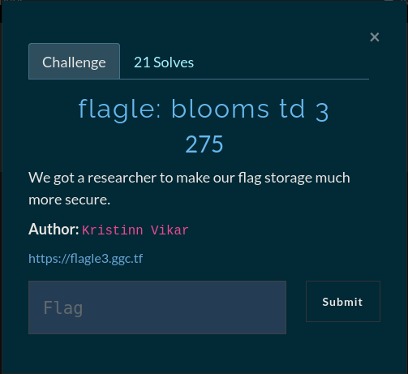

### Bloom filter



 Here we have a flagle challenge in the *rev* category which means there will be some javascript reversing needed to pass the challenge. Reading the challenge description gives out a nice hint. bloom is being used as a reference to the game *Bloons td 3* but what is maybe more useful to us is the refrence to the [*Bloom filter data structure*](https://en.wikipedia.org/wiki/Bloom_filter)

## Recon
Taking a look at the challenge website we are again presented with the wordle game so we instead look at the source code of the game which we find inside `game.js` The code is quite unreadable looking at a single line so using any online **Javascript Beautifier** should solve our problem. Looking at the code we can confirm that we are indeed using a *Bloom filter data structure*. This data structure is used to check whether an element is a member of a set, the response can be a *False positive* but never a *False negative* which essentially means that we can know each element in the set by knowing which elements are not in the set. Looking at the code with this in mind we quickly find a function that we could abuse to get our flag. `CheckInFilter(e, t)`


## Getting our flag
Using the `CheckInFilter()` function we can bruteforce the flag by supplying the string to search for and at what index `CheckinFilter(LETTER, INDEX) -> true,false`

Paste this code into the console and call the function `get_flag()`

```javascript
var flag = [];
var filter_index = 0;
const alphabet = "abcdefghijklmnopqrstuvwxyzABCDEFGHIJKLMNOPQRSTUVWXYZ1234567890!@#$%^&*()_+-={}";

function get_flag() {
        for (let i = 0; i < alphabet.length; i++) {
                var letter = alphabet[i];
                var check_letter = CheckInFilter(letter, filter_index);
                if (check_letter == true) {
                        flag.push(letter);
                        filter_index = filter_index + 1;
                        i = 0
                        if (filter_index == 23) {
                                break;
                        }
                }
        }
        return console.log(flag.join(''));
}
```

**FLAG: gg{bur70n_h0w4rd_bl00m}**