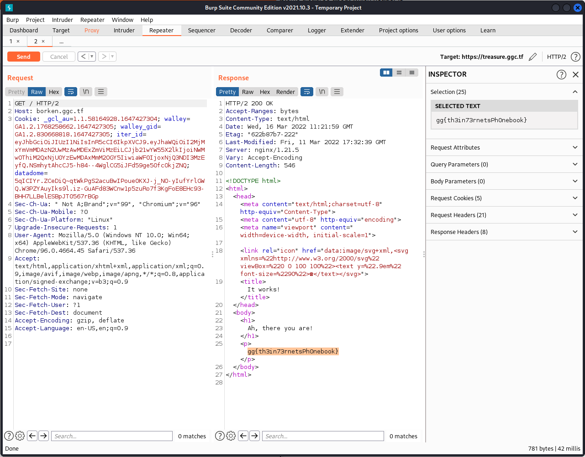

# Borken

https://portswigger.net/web-security/host-header/exploiting

### Recon

Upon visiting the URL `https://borken.ggc.tf` we see that Burp Suite tells us that the
IP address of that domain points to `127.0.13.37` which is not accessable to us for now.

Looking at where other web challenges are hosted we get that every challenge that has a
web server has the IP address `178.62.53.14` which is indeed accessable to us.

### Exploitation - Host header vulnerability

Now we know that all of the working challenge instances point to `178.62.53.14`
and the one we want to access points to `127.0.13.37` we can modify the host header
on the working challenge (accessable) instance to point to the localhost one `borken.ggc.tf`

