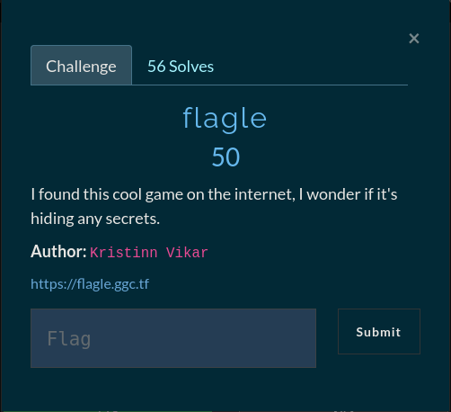
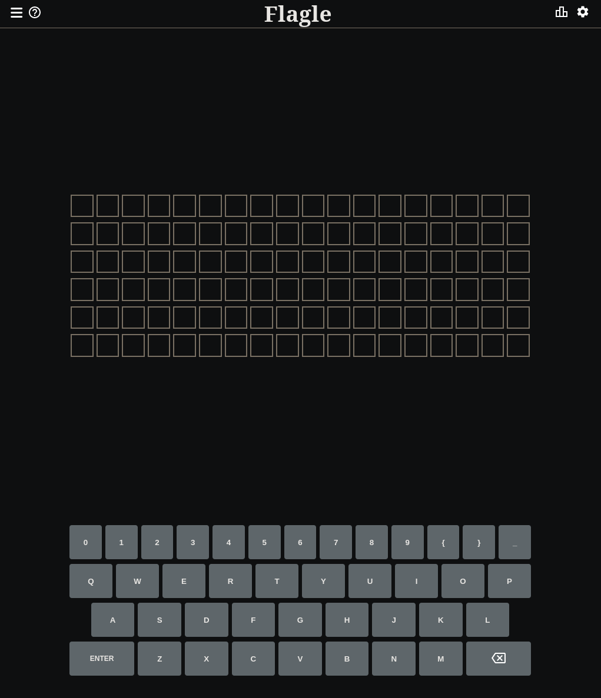

## flagle

We are told that there might be some secrets hiding somewhere on the webpage so let's take a look at the website

Upon visting the website we are presented with a worlde puzzle. Looking at the source code of the page we see that there is some custom javascript being ran for the game to function on *Line 200* `` if we open that up we should see the flag stored in a const variable `const FLAG = "gg{flagle_is_life}"`

**FLAG: gg{flagle_is_life}**