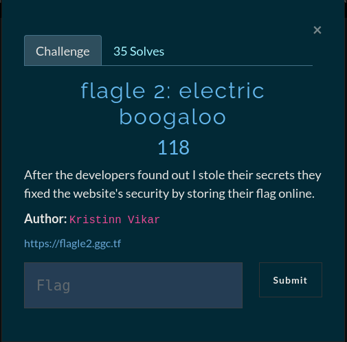

# flagle 2



```python

#!/usr/bin/python3
import requests

FLAG = ""
ALPHANUM = "0123456789abcdefghijklmnopqrstuvwxyzABCDEFGHIJKLMNOPQRSTUVWXYZ_{}!?"

while True:
	for i in ALPHANUM:
		web_req = requests.get(f"https://flagle2.ggc.tf/check/{FLAG+i}")
		flag_check = web_req.content.decode('latin-1')[-1]
		if flag_check == "y":
			FLAG += i
			print(f"[+] FOUND: {FLAG}")
			break
		elif FLAG[-1] == "}":
			exit(0)
		else:
			print(f"[!] TRYING: {i}")
```